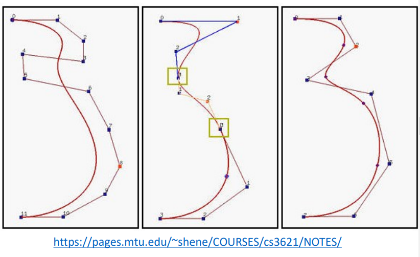

# Computer Graphics Notes 
A review for Computer Graphics Course.
This course is about the basis of Computer Graphics, covering topics including Basis piplines, Rasterization, Shading etc. Meahwhile raytracing techinques are not discussed much. 
This course is given by Prof. Zhao Junqiao. 
Course homepage: [CG](http://cs1.tongji.edu.cn/courses/CS100433/)

## 1 Introduction 
1. modern grpahics pipeline 
   3 stages: application stage, geometry stage, rasterization stage 
   +   Input data 
   +   Vertex shading 
   +   Geometry shading 
   +   primitive setup 
   +   Rasterization 
   +   Pixel Shading (Fragment shading)
   +   FrameBufferBlend 
1. key concepts 
   +   graphics pipeline 
   +   solid modeling 
   +   GLSL
2. Questions
   +   Draw a pipepline 
   +   what does programmable mean? 
   +   vertex & primitvie & fragment
       +   which poses more influence on the frame rate of a cg application? 
## 2 Viewing modelling basics 
1. Object specification 
   +   primitives: points,line segments, polygons,curves 
   +   all are defined through vertices(**locations in space**)
2. Synthetic Camera Model
   +   six degrees of freedom: positions,orientation
   +   lens, 
   +   film size 
   +   film plane positions 
   

3. Viewing 
based on the relationship among elements(objects)
4. Viewing transformations 
   +   modelling transformation: object space-> world space 
   +   camera transformation: world-> camera space 
   +   projection transformation: -> canonical view volume
   +   viewport: -> screen space 
5. Normalized Device coordinates(NDC)
coordinates are in the range -1 to 1
6. Viewing implementation:
transform into camera coordinates
perform projection into view volume
**clipping**
perspective-division: from 4-dim to 3-dim (NDC) 
remove hidden surfaces
7. 2D viewing 
   the concept of **clipping window**
   +   Zoom in/out: adjust viewport or clipping window? 
   A: clipping window
8. camera movement
position movement & look-at direction changes
"glm::lookat"
9. projection
   from 3d to 2d 
   +   orthographic 
    preserve both distances and angles -> suitable for measurements
   +   perspective 
   more realistic 
   nonuniform foreshortening  
   angles are often not preserved 
10. perspective projection 
**frustum**: a 3d clipping volume

11. Geometry & topology 
geometry: loactions of the vertices 
topology: organizations of the vertices and edges 
12. 3d representation
    +   solid modeling: surface based & volume based
13. Surface based: 
    B-rep: boundary representation: representatino by **bounding low-dimensional elements**
    planar faces, edges ,curved surfaces 
    +   Pros: flexibile for rendering 
    +   Cons: approximations, representation is not unique. 
14. Volume based
    +   Constructive Solid Geometry:CSG
    use boolean operations,primitive solids 
    Pros: water tight models  
    Cons: complex to establish an object
    +   Spatial decomposition: Voxels, Octree,BSP
    Pros: easy to compute colume, make slices
    Cons: massive data, rough surface 
    +   point cloud
15. Key concepts
   +   Homogeneous coordinates 
   +   affine transformations 
   +   Camera & viewing frustum 
   +   Projection transformations & clipping 
   +   visible surface detection .. 
## 3 Introduction to OpenGL
## 4 Transformation
1. translation 
2. linear transformation 
linear transformations can be represented in matrix form 
**rotation, scale, shear,reflection are all linear**
translation is **NOT** linear
3. Homogeneous coordinate
extra compent: w 
w is 1 if point 
w is 0 if vector 
-> point - point = vector; point + point = midpoint
4. rotate around a particular point 
$M=T^(-1)RT$where T means translation & R means rotation 
5. **Compelx motions**
$M_i$ means i-th transformation around the center of the object.
then in the world space, 
$p^n = M_1M_2M_3...M_np$ 
notice the sequence is the reverse.
**Important conclusion**
6. General rotation matrices 
   rotation in 3d around an arbitrar axis
   specify a rotation
   +   axis and angle(positive is right handed) 
   +   euler angles(3 angles & 3 axes)
   +   quaternions
7. Euler angles
   $A = BCD$ where BCD are rotations around 3 axies
   +   $\Phi$ roll: around x 
   +   $\Theta$ pitch: around y 
   +   $\Psi$ Yaw: around z 
   z coordinates is "down",y points east, and x points north
8. Gimbal lock
Euler angels may course gimbal lock
when rotation around y is 90 deg, a freedom degree is lost.
9. general rotation


10. quaternions


11. rodriguez formula 

## 5 Viewing 
1. default viewing settings 
camera is at the origin & points to neg z position 
2. lookat matrix 


3. projection transformation
   +   orthographic 
   +   perspective 
4. orthographic projection
simply set z value to 0
5. perspective projection
   要考察推导过程！ 
   +   translation 
   +   unify 
   +   constraints
6. Clipping 
   clipping happens in **homogeneous clip space**
   4d-space before perspective division   
   why-clipping in 4d space
   +   avoid degeneracies: avoid drawing things behind the eye & avoid division by 0
   +   imporve efficiency by avoiding drawing objects outside the boundary
7. Clipping points->easy
8. Clipping 2d line segs 
**Cohen-Sutherland** algorithm


use outcodes to define various situations 
$A_0A_1A_2A_3$ each code is 1 if "outside" the boundary
5 cases
   +   outcode(A) == outcode(B) == 0
      accept
   +   A = 0 && B != 0
      compute intersection. location of 1 determines which edge to intersect with.
   +   A != 0 && B!=0 
      if bitwise A & B != 0, this means two points are in a "same" area, and there won't be any intersection. 
      if is 0. compute intersection with regard to the poisiton of 1. 

   out codes work for arbitary primitives. 
   

9. 3d clipping 
6-bit outcodes 

10. Clipping polygon
problem: for concave polygons, clipping may yield multiple polygons.
**Weiler-Atheron Clipping**
    +   "Walk" around the boundary.

11. Tessellation and Convexity 
replace concave polygons with a set of triangles. 
12. Clipping Convex Polygon
**Sutherland-Hodgeman** Clipping
clip against 4 side of the window-> line clipping 


apply the process above to 4 edges-> final result. 

1.  Key concepts
    +   Perspective projection is important 
    +   Cohen sutherland line clipping 
    +   Weiler-Atheron clipping 
    +   Sutherland hodgeman clipping (polygon)

## 6 Visible Surface Detection 
1. visibilty of primitives
   +   primitive lies outside fov(clipping)
   +   primitive is back-facing(culling)
   +   primitive is occluded by other objects
2. algorithms
   +   back face culling,BSP tree, painter's algorithm 
   +   z-buffering (image space)
3. Culling 
compute the dot product of view and primitive's normal vector. 

4. hidden surface removal 
pairwise tesing between polygons-> $O(n^2)$for the worst case.
5. painter's algorithm
render polygons from back to front order. 
-> Depth sort $O(nlogn)$ for ordering 
don't work when objects overlap with each other or penetration occur.

6. BSP tree
   (Binary Space Partitioning)
   +   Choose polygon arbitrarily
   +   divide scene into front and back half-spaces(**relative to normal**)
   +   split any polygon lying on both sides
   +   recursively repeat the process. until each node contains only 1 polygon
7. how to decide objects' prority with BSP tree
   +   start at root polygon
   +   if viewer is in front half-space,draw polygons behind root first. then the root and the polygons in front 
   +   if viewer is in back half-space,draw polygons in front root first. then .. .
   +   if polygon is on edge,do either 
   +   recursively do the process
   
   pros:
   +  cheap to check visibility once tree is set up.  
8. octree
9. Image Space Approach:z-buffering 
   complexity $O(n*m*k)$,n,m is the parameters relative to resolution & k is number of polygons.
   z-buffer idea:
   
   +   rasterize each polygon 
   +   calculate corresponding z value for every pixel 
   +   track depth values of closest polygon
   +   pain the pixel with the color of closest polygon 
       +   Triangle Rasterization
           use barycentric coordinate to decide whether a poitn is inside the triangle or not.
           use bounding box to accelerate the process. 
   
10. Advantage & disadvantage of z-buffering 
    +   Pros
        +   simple to implement
        +   diversity of primitives
        +   unlimited scene complexity 
        +   don't require calculations for object-object intersections  
    +   Cons
        +   extra memory(not even a thing nowadays)
        +   wawste time drawing invisible objects
        +   **precision errors**
11. Precision erros
    

z-buffer precision is caused by the perspective divsion 
thus, it's wise to push zNear out and pull zFar in.

13. Area Subdivision (Warnock's Algorithm)
divide the area into smaller parts until there's only a single non-intersecting polygon


14. Portal culling 
often used in indoor arrangement
use tree structure to model the house layout. 

15. Key concepts
    +   Culling 
    +   BSP tree: build & display 
    +   z-buffer(rasterization)
    +   z-fighting/precision errors
    +   warnock algorithm
## 7 Rasterization 
1. display hardware
   -> idea of rasterization
   +   CRT:cathode ray tube 
   +   LCD: liquid crystal displayu 
2. frame buffer model 
   +   fragments ahve a location and other attributes 
   +   .. 
3. Rasterization
   Converting a continuous object into discrete pixels 
   +   enumerate pixels covered by a primitive 
   +   interpolate values across the primitve(colors at vertices & normals)
4. rasterize points
simply count the number of points inside the pixel(which is a square)
5. rasterize lines
given:segment endpoints
identify the set of pixels to display for segment
6. DDA(digital difrerence analyzer)
basic idea: select pixel vertically closest to line segment.
**psedo code**
7. Bresenham algorithm
-> avoid floating point arithmetic, avoid round operations
start point: $d_0 = 2 \delta y -\delta x$
key point: $d_{k+1} = d_k + 2\delta y-2\delta x$ if dk > 0
else: $d_{k+1} = d_k+2\delta y$
8. Mid-point algorithm
plot curve. e.g. plot circle 
$d_k=D(x_k+1,y_k-0.5)=(x_k+1)^2+(y_k-0.5)^2-r^2$
$d_k+=$ if dk<0 $2x_{k+1}+1$ else $2_{k+1}+1-2y_{k+1}$

9. rasterize triangles 
10. Inside & outside test 
odd-even rule. 
if a ray has odd intersects with polygon -> inside 
even intersects -> outside.
11. rasterize concave polygons
draw pixels when parity is odd 

12. Triangulation
graphics hardware is optimized for triangles 
& triangle drawing is fast. 
13. Trapezoid(梯形) decomposition
Seidel's Algorithm


14. interpolation of attributes
attributes are interpolated during rasterization
15. interpolation for line 
use dda to interpolate 
16. interpolation for triangles
barycentric corrdinate(or interpolation while filling spans)


17. anti-aliasing 
    +   box filtering: counting number of subpixels
    +   weighted filtering: such as gaussian filter
    +   Xiaolin Wu's line algorithm
18. Key concepts

## 8 Illumination and Shading 
1. color model 
   +   RGB 
   +   CMY
   +   HSV model
   Hue,Saturation,Value(Brightness) 
2. shading 
   depend on 
   +   geometry 
   +   lighting 
   +   material 
3. illumination model
   +   Global illumination model 
   +   local illumination model 
4. GI methods
   +   Ray tracing 
   +   Radiosity 
   +   Photon Mapping 
   +   ...
5. local illumination methods
   +   Gouraud shading 
   +   Phong shading 
   +   .. 
6. light models 
   +   point light 
   +   directional 
   +   spotlight 
   +   area light 
   +   volumetric light 
7. Point light 
attributes: positions, intensity, coefficients to specify its attenuation property with distance d
$f = \frac{1}{a_0+a_1d+a_2d^2}$
8. direcitonal light
no attenuation 
9. spotlight model 


10. Phong reflection model 
-> empirical 
ambient 
diffuse reflection: lambert's law

ambient + diffuse + specular 
phong specular term: the dot product of view and reflected
Blinn specular term: dot product of half vector and normal (require higher exponent to achieve the same effect)


11. Shading methods
    +   Flat shading 
    constant intensity surface rendering 
    +   Gouraud shading 
    estimate the normal of each vertex by averaging the normal of its surrounding surfaces. 
    compute the color for each vertex
    interpolate the color based on barycentric coordinates
    +   Phong shading 
    interpolate surface normals and comptue shading based on interpolated normals
## x RayTracing 
This chapter is not a lecture, but rather a reference to "Raytracing in a weekend"(a tutorial offered by Steve Hollash)
## 9 texture mapping 
1. **texture map** & **texel** & **UV** coordinates
2. material & texture
   +   material is the intrinsic properties of a surface defining how light interacts with the  surface. 
   +   texture is an image-based data describing appearance property
3. surface texture mapping 
u,v -> world space surface 


**uv can't be interpolated linearly in screen space** becase perspective projection will cause distortion.


4. perspective correction(how?)
u,v should be divided by the depth
using $(\frac{u}{w},\frac{v}{w})$ in homogeneous coordinates
5. orthogonal mapping 
6. cylindrical mapping 
7. Spherical mapping 
8. UV mapping 
9. Aliasing of textures 
when several texels cover a single pixel, or the textured surface is magnificateed too much, aliasing happens.
10. Mipmapping
use a texture of multiple resolutions. switch the resolution according to the number of texels in one pixel.
11. Bump mapping 
compute the normal from the partial derivatives in the texture
12. displacement mapping 
actually move the surface point. geometry is displaced before visibility is determined.
13. environment mapping 


14. cubic mapping 
-> sky box 
using vertex coordinates as texture directions
take away the translation from view matrix 

## 10 Geometric Modelling 
1. mesh validity
   +   manifold 
       +   no edge is shared by more than 2 polygons; faces adjacent to a vertex form a single ring.
       +   edge points: each edge have exactly 2 triangles \
       +   each vertex has one loop of triangles. 
   +   manifold with boundary 
       +   weaken rules to allow boundaries
2. topological validity 
   consistent orientation 
   rule: 
   
   +   outside: vertices are in counter-clockwise order.  
3. Geometric validity 
   +   no self intersecting surface 
4. Combinatorial structure 
Gemetry & topology
5. requirements for mesh data structures
   +   Compactness
   +   Efficiency for rendering 
   +   efficiency for queries
6. mesh data structures
   +   independent triangles(triangle soup)
   +   indexed triangle set 
   each face lists vertex references -> shared vertices. no adjacency
   +   **triangle strips** and triangle fans 
    very creative idea. 
    

    triangle fans have a similar idea. 
    

   +   triangle-neighbor data structure 
   extension to indexed triangle set. 
   triangle points 
   +   \
   +    to its three neigboring triangles. 
   +   winged-edge data structure 
   based on edges. store all vertex ,face, and edge adjacencies. 
   +   **half-edge** 
    
    
7. level of detail (lod)
8. vertex removal 
   +   face collapse 
   +   edge collapse
   
   **use half-edge data structure** to implement.
## 11 Curves and Surfaces 
**Key Point** 
Spline Curves derivation 
1. Spline Curve 
   +   Smooth curve defined by control points 
   +   two types: **interpolation** & **approximation**
2. Interpolation Curves 
   +   pass through all control points 
   +   Given points $P_0,P_1,...$find **lowest** degree polynomial that pass through all ponits
   (parameterized curves)
   $x(t) = a_{n-1}t^{n-1}+....+a_{0}$
   $y(t) = b_{n-1}t^{n-1}+...+b{0}$
3. 推广：$Q(t) = GBT(t)$
  G: Geometry
  B:Spline Basis 
  T:Power Basis
4. e.g. Linear Interpolation 

5. Hermite Curve
  Constraints: endpoints and tangents 
  Picewise cubic: use cubic polygons to define curves
  **Solve constraints to find coeffcients for cubic curves** (four equations: 2 for points, 2 for tangents->solve 4 coeffcients) 
  
  where p are constraints
  the formula at the bottom shows that $b_i(t)$ can be regarded as "basis" vectors. 
6. result of hermite
  
  
4. Interpolation vs Approximation 
**Interpolation Curves can be over strained (same as overfitting in ML)**

Approximation curves can solve this problem
5. Bezier curve
replace tangents with 2 points -> avoid a mixture of points and vectors 

9. From Hermite to Bezier
  
  and The original formula becomes: 
  
  Thus we can get the Bezier Matrix 
  
  Other definitions for this: **Berstein polynomials**
  $B_i^n(t) = \frac{n!}{i!(n-i)!}t^i(1-t)^{n-i}$
  (extension for n-dim cases)
10. Another Way to derive Bezier segments 
  basic idea: interpolation 
  interpolate twice to find a point for a given t (for cubic cases)
  
  For n-dim polynomials, n points are needed. 
  **de Castljau's algorithm** 
8.  Continuity 
    $C^n$ continuous 
    why should we discuss about Continuity: low-order curves have better performance but low-order curves can't fit very complex curves.
    +   $C^0$:not smooth,but "water tight"
    +   $C^1$:smooth & no facets 
    +   $C^2$:important for shading. 
9. Connect cubic Bezier Curves
how to guarantee $C^n$ continuity? 

10. Properties of Bezier Splines 
    +   COnvex hull property 
    +   Continuity 
    +   Affine invariance
11. BSpline
more than 4 points,Knot points 
Locally cubic Bezier splines,low order in general 
Curve is not constrained to pass through any control points

Bspline can assure $C^2$continuity
The following picture is a comparison between these 2 splines

12. NURBS 
    Non-uniform rational bspline
    why should we introduce NURBS? 
    +   circles can't be represented by splines above.
    features: 
    +   non-uniform: different spacing between blending fucntions(basis functions)
    +   rational:quotients(商) of polynomials
16. Subdivision Curve
    **Chaikin's algorithm** 
    subdivide broken lines
    
    continue this process many times->each time the curve becomes smoother. 
14. Spline Surface 
define a surface as the tensor product of two curves 

15. Subdivision surface 
Chaikin's algrothm

## 12 Shadow & Ray Tracing 
1. ground shadow
   shadow cast by objects onto the ground
   rendering process
   +  draw the object 
   +  multiply the shadow matrix(project the object onto the ground)
   +  redraw the object in gery.

   problem: only cast onto planes 
   hard shadow 
   performance is not optimal 
2. shadow texture
   +  use a shadow image as a texture 
3. shadow map 
two rendering pass 
first pass: render shadow map (record depth buffer)
second pass: render scene based on shadow maps.
4. shadow volumes
5. stencil buffer
   +  a data buffer
   +  used as a stencil 
   +  an integer per peixel 

   result is a hard shadow 
6. soft shadow
can be modelled by a collection of point light sources.
take umbra & penumbra into consideration. 
7. shadow map & shadow volume
   +  shadow map is much faster 
   +  at the cost of accurary(due to resolution of depth buffer)
8. Ray tracing topics 
9. Opengl & ray tracing 
   +  opengl is based on a pipeline model in which primitives are rendered one at a time. 
   -> no shadows
   -> no multiple reflections 
   +  global approaches
      +  rendering equation 
      +  ray tracing 
      +  radiosity 
   +  ray trace: iterate over pixels instead of primitives. 
10. ray tracing pesudo code
```python 
for each pixel:
   shoot a ray from camera to a pixel 
   for all objects in scene:
      compute intersection with ray 
   find obejct with the closest intersection 
   recuisively shoot rays from the intersection point 
   display color using object + light properties
```
Q: how to accelerate the process with BVH structure?
11. ray tracing shadows
    +  when ray hits an object,a secondary ray called **shadow ray** is shot towards the light source to decide when the pixel is inside the shadow or not.
12. ray tree
rays are generated recursively 
13. diffuse surfaces 
    +  one way: trace the transmitted and reflected rays but use phong model to compute shading 
    +  second method: sample the scattering rays by using monto-carlo
14. ray casting
    +  only rays that reach the eye matter 
    +  reverse direction and cast rays 
    +  at least one ray per pixel
15. ray cast techniques for CSG objects 
apply boolean operations on ray segments.


16. ray-sphere intersection
17. ray-box intersection
similar to clipping algorithm


18. shading 
use Phong reflection model 
19. acceleration
    +  efficient intersection 
    +  necessary intersection 
       +  avoid meaningless intersections 
       +  BVH
       +  Octree
       +  BSPtree
       +  Kdtree
    +  parallel tracing 
20. BVH (bounding volume hierarchy)


1.  Octree
